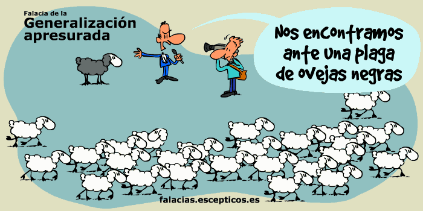
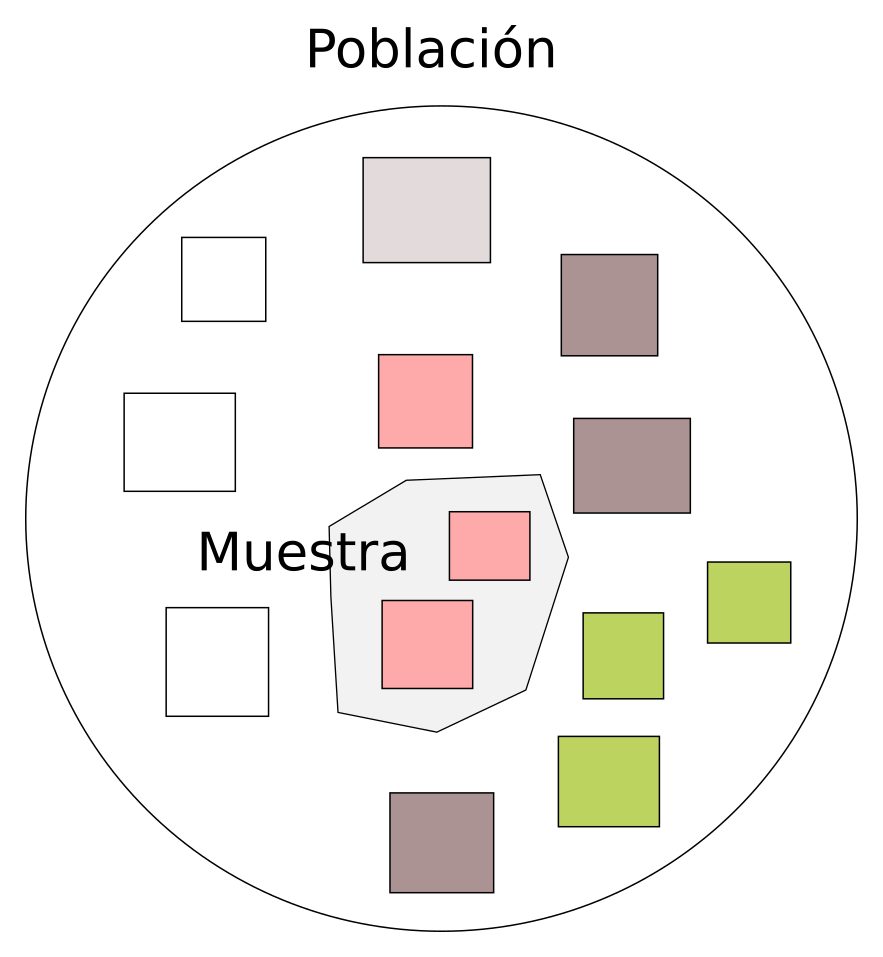
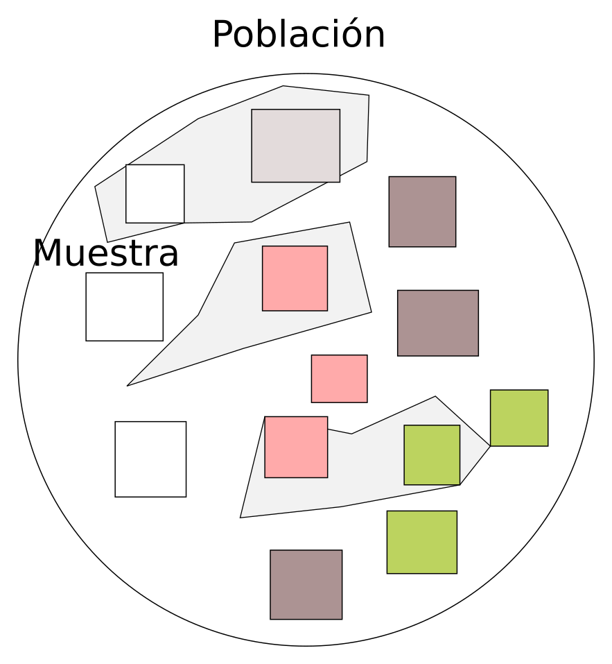

```{r setup, include=FALSE}
knitr::opts_chunk$set(dev = 'pdf')
```

### Generalizar

Muestra $\rightarrow$ Población

Particular $\rightarrow$ General

### Condición

Para generalizar a partir de muestra necesitamos que:

Muestra $\approx$ Población

### ¿Qué pasa si no se cumple?



### ¿Qué pasa si no se cumple?

1. Descripciones no reflejan realidad

2. Riesgoso hacer recomendaciones basadas en evidencia sesgada

3. Manejo ineficiente

    - Consecuencias políticas

### Ejemplo



### Ejemplo

En la muestra del polígono gris

- ¿Cuál es el color más común?

En la población

- ¿Cuál es el color más común?

### Soluciones



### Soluciones

- Muestra más grande

- Muestra más aleatoria

- Diseño de muestreo/experimental

### Estrategias para obtener datos

1. Experimentos

    - Diseñar procedimiento para replicar sistema o componentes

2. Observaciones

    - Hacer mediciones directamente en campo
    
### Ejemplos

- Experimentos

[Evolución del cauce de un río](https://www.youtube.com/watch?v=BuIYh17daSs)

### Ejemplos

- Observaciones

1. [Efectos del *Greenness* en la natalidad](https://www.sciencedirect.com/science/article/abs/pii/S0013935120314961)

2. [Impacto del estrés por calor en el riesgo de lesiones ocupacionales](https://onlinelibrary.wiley.com/doi/abs/10.1002/ajim.22946?casa_token=YsxyobqagVoAAAAA:wQw6Ys7vyJwmpNFknOv29Y88asNazOdFFxWnQ-gvo87DQ9sjU1wbOuPml275U9NDWdcze3fsDCGO0Vw)

### Estrategias observacionales

1. Colectar muestras en campo

    - Muestras de sedimento de río
    - Entrevistas a actores clave

2. Consulta de registros gubernamentales

3. Encuestas

    - Visitas a comunidades
    - Virtuales
    
4. Ciencia ciudadana

    - [Naturalista MX](https://naturalista.mx)