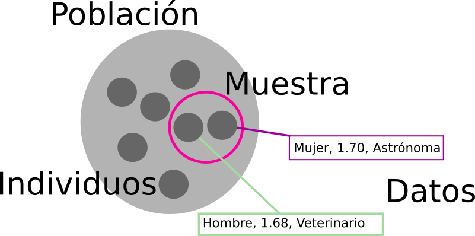
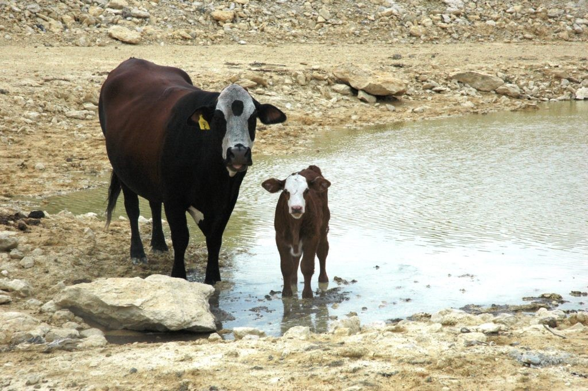

```{r setup, include=FALSE}
knitr::opts_chunk$set(dev = 'pdf')
```

# Población

### ¿Qué entienden por población?

- "Población de Mérida" vs. "Población de estudio"

### ¿Qué entienden por población?

- *Población* - Grupo que se va a estudiar
- *Muestra* - Individuos de la población de estudio
- *Individuos* - Personas, animales u objetos que forman la muestra

### De poblaciones a individuos



### Importancia

```{r echo=F, fig.align='center', fig.height=4, fig.width=4}

```

### Importancia

- No se puede estudiar todo

    - Dificultades logísticas
    - Dificultades económicas
- Fenómenos de relevancia regional
- Diferentes escalas

### Ejemplos

- **Población**: Ciudad Caucel
- **Muestra**: 10 familias de cada colonia
- **Individuo**: Integrantes de la familia

### Ejemplos

- **Población**: Industria pecuaria de Hunucmá
- **Muestra**: Granjas porcícolas < 1 km de cenotes
- **Individuo**: 1 L de desecho de lagunas de oxidación

### Criterios para seleccionar población, muestra e individuo

- Objetivo del estudio

    - ¿Qué se quiere demostrar?
    - Pregunta científica concreta
    - Análisis estadísticos a realizar
    - Hipótesis que a probar
    
- Datos necesarios

    - Mediciones de l_s individu_s
    - Cuánt_s individu_s
    - Características de l_s individu_s

# Ejemplos

### ¿Cómo afecta la ganadería la calidad del agua?



### ¿Dónde colectarían el agua?

1. Donde hay ganado
2. Donde no hay ganado
3. Dentro del rancho
4. Fuera del rancho
5. Río abajo o arriba del rancho

### Propuesta

1. Objetivo
2. Hipótesis
3. Pregunta específica
4. Determinar qué se medirá
5. Determinar cómo se analizará
6. Determinar cuántos datos
7. Determinar población
8. Seleccionar muestra
9. Muestrear
10. Analizar