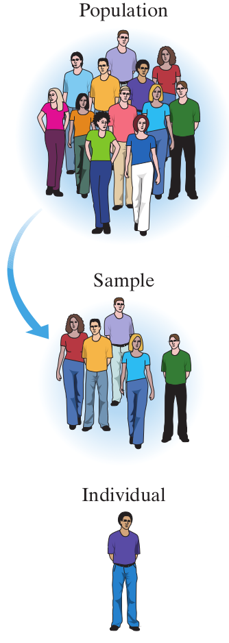

# Población

### ¿Qué entienden por población?

- "Población de Mérida" vs. "Población de estudio"

### ¿Qué entienden por población?

- *Población* - Grupo que se va a estudiar
- *Muestra* - Individuos de la población de estudio
- *Individuos* - Personas, animales u objetos que forman la muestra

### De poblaciones a individuos

```{r echo = F, fig.align='center'}

```


