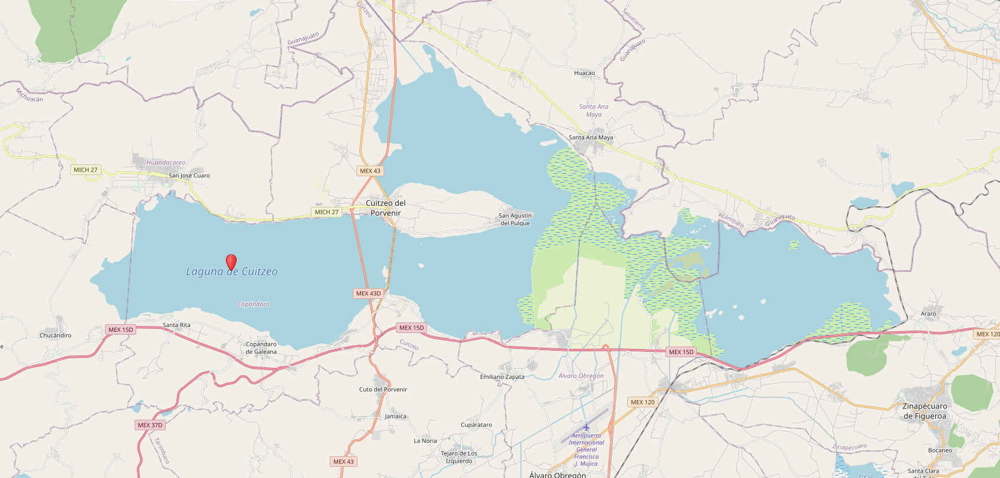

```{r setup, include=FALSE}
knitr::opts_chunk$set(dev = 'pdf')
```

### Técnicas vs. Diseño

- Diseño: Estudios experimentales, híbridos y observacionales

- Técnicas de muestreo: Híbridos y observacionales

- Técnicas no son reemplazo del diseño

    - Estrategias logísticas para colectar datos de la manera más robusta posible

### Tipos

- Censo $\rightarrow$ Registrar todo

- Muestra $\rightarrow$ Registrar sólo parte de la población

### Muestreo

- Simple aleatorio

- Estratificado

- Agregado

- Sistemático

- Conveniencia

### Simple aleatorio


### Simple aleatorio



### Estratificado


### Características

- Muestras más representativas

- Ejemplos en ciencias ambientales y sociales, selección de sitios para entrevistas.

### Estratificado


### Agregado (Clúster)


### Características

- En cada clúster se hace un censo

- Sesgos locales muy evidentes

- Ejemplos en estudios demográficos y preferencias electorales

### Clúster


### Sistemático


### Sistemático


### Conveniencia


### Características

- Es el más sencillo

    - Se obtiene muestra de lo más conveniente

- Sesgo muy alto

### Conveniencia


