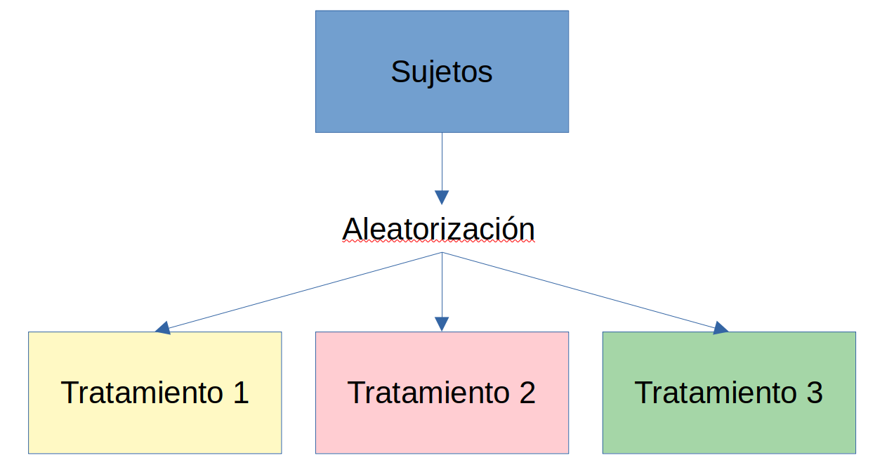
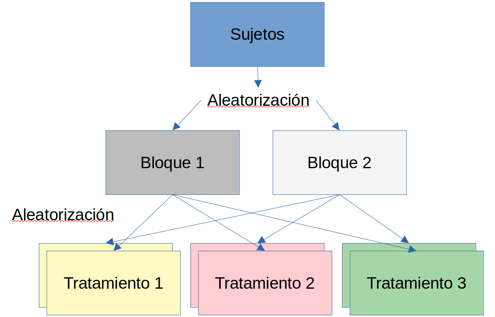
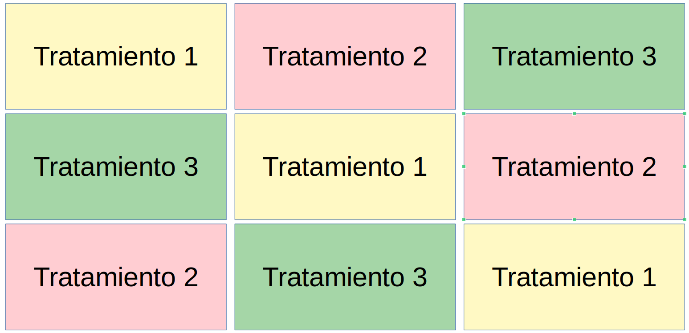
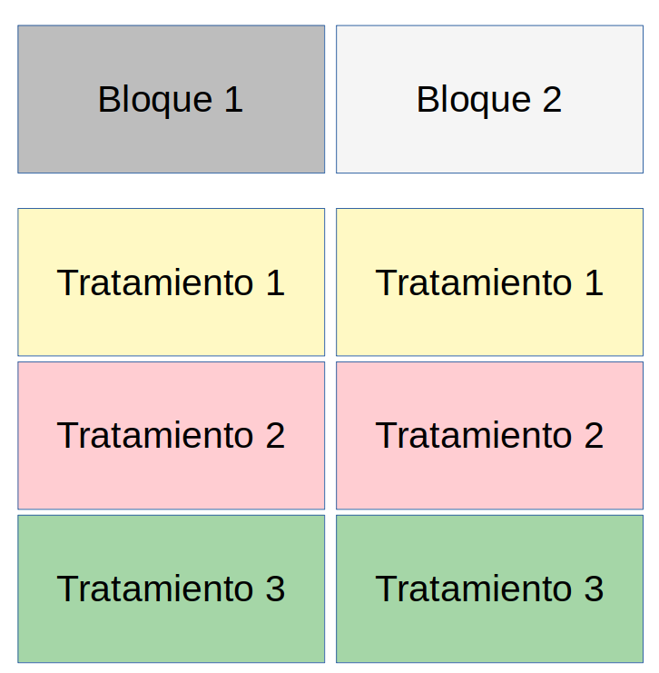

```{r setup, include=FALSE}
knitr::opts_chunk$set(dev = 'pdf')
```

### Características de diseños experimentales

1. Aleatorizados

2. Replicados

### Aleatorizados

- Muestras seleccionadas al asar

- Unidades experimentales asignadas al asar

- Ubicación de unidades es aleatoria

### Réplicas

- Tratamientos experimentales

- Unidades experimentales

- Sitios de muestredo

### Objetivo del diseño

- Repetitividad

    - Que las hipótesis probadas sean predictivas a escalas comparables
    
    - En otros experimentos
    
    - En contextos más amplios que experimentales
    
### Relación entre diseño e hipótesis

- Diseño debe permitir probar hipótesis estadística

- Factorial

    - Factor = variable independiente
    
    - Variables medidas = variable dependiente

### Tipos

1. Completamente aleatorizado

2. Bloques aleatorizados

3. Cuadrado latino

4. Split Plot, o parcelas divididas

5. Rejilla

6. Aumentados

### Aleatorizado



### Bloques aleatorios



### Cuadrado latino



### Split plot



